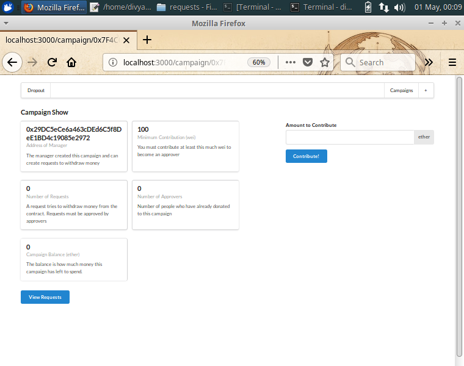
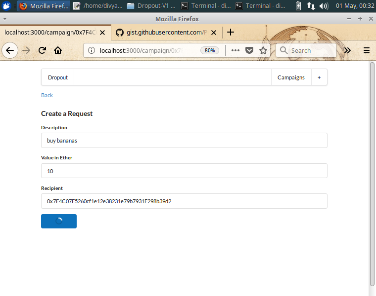

# Dropout

Fund your dreams.

## Getting Started

These instructions will get you a copy of the project up and running on your local machine for development and testing purposes. See deployment for notes on how to deploy the project on a live system.

* Clone the repo
* run npm install
* change the manager address in the factory.js file with your address from metamask account
* also change the seed file nmenoic code to your own.

### Prerequisites

What things you need to install the software and how to install them

* metamask
* infura account

## Running the tests

* run __npm run test__ command in the terminal.

## Deployment

* after you have installed all the dependencies, you can fire up your browser
* and visit localhost:3000

## Built With

* [React](http://www.reactjs.org/) - The frontend framework used
* [NextJS](https://nextjs.org/) - Server side Rendering framework used
* [SemanticUI](https://semanic-ui-react.org) - Used for the custom components
* [Ethereum](https://ethereum-project.org) - The Blockchain
* [Ganache-CLI](https://truffle.org) - The testing framework

## Contributing

Please read [CONTRIBUTING.md]() for details on our code of conduct, and the process for submitting pull requests to us.

## Authors

* **Divyansh Dwivedi** - *Initial work* - [Divyansh Dwivedi](https://github.com/justdvnsh)

See also the list of [contributors](https://github.com/your/project/contributors) who participated in this project.

## License

This project is currently unlicensed

## Screenshots

